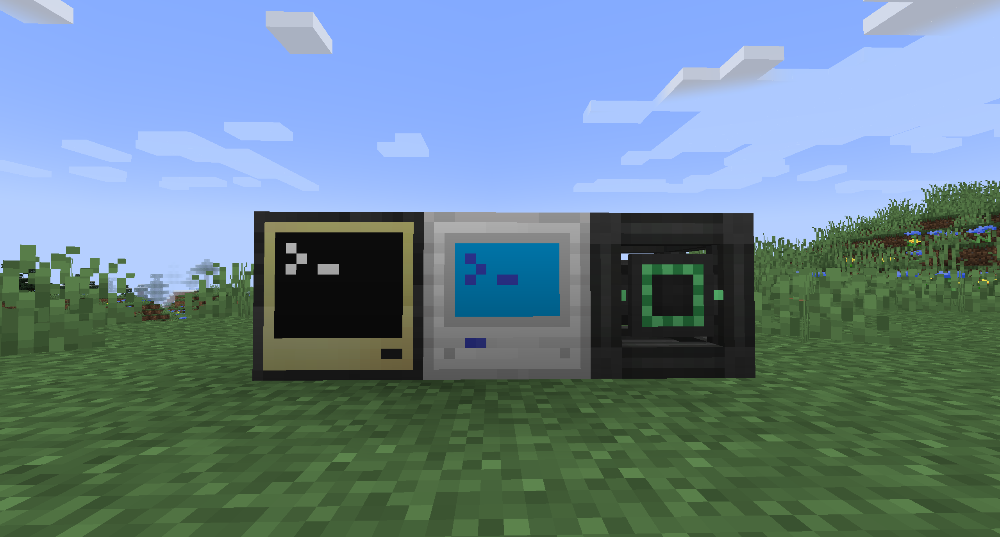

# Digital Items 2.0

[GitHub page](https://github.com/Cookie04DE/Digital-Items-2)

[Curseforge page](https://www.curseforge.com/minecraft/mc-mods/digital-items-2)

This project is the successor to the original [Digital Items](https://www.curseforge.com/minecraft/mc-mods/digital-items) mod.
These are the main differences:
- Longer item IDs; 128 bit instead of 32 bit
- The inclusion of the decay system (see below)
- Various balance changes (such as a more expensive crafting recipe and a reduced amount of information about items)

This forge mod allows you to turn your items into numbers (called IDs), which you can store or send to your friends and then turn them back into their item form.
Every ID is unique, can't be guessed, and can only be used once.

No duplication or cloning of items is possible.
The process of turning an item into an ID is called 'digitization' and turning it back is called 'rematerialization'.

Items that are digitized begin to 'decay'. If they are left digitized for too long, they are gone.
You can reset their 'decay countdown' by 'refreshing' an item ID or partially rematerializing it.

You can retrieve information about digitized items via their ID and items inside the digitizer itself.
All of these operations are performed inside the 'digitizer', and require a configurable amount of energy.

These operations are exposed in the form of a peripheral for the [CC: Tweaked](https://www.curseforge.com/minecraft/mc-mods/cc-tweaked) mod.

## Q. & A.
### How do I use this mod?

Place a digitizer and computer (either directly next to one another or connected with network cables and modems).

Place the item you want to digitize inside the digitizer.

Now you can interact with the digitizer with lua.

Use `digitizer = peripheral.find("digitizer")` to find the peripheral and bind to the `digitizer` variable.
The following methods are available to call on the `digitizer` peripheral:

- `getEnergy()` Returns the amount of energy currently stored inside the digitizer.
- `getEnergyCapacity()` Returns the maximum amount of energy the digitizer can store.
- `getPerTickEnergyDraw()` Returns the amount of energy the digitizer can draw (or that be extracted) per tick.
- `getEnergyRequired()` Returns whether the digitizer requires energy to operate.
- `getDecayEnabled()` Returns whether the digital items decay.
- `getDecayTicks()` Returns the duration in ticks after which digital items decay.
- `getDigitizeCost()` Returns the energy cost of digitizing a stack of items.
- `digitize()` Digitizes the item stack and returns the ID.
- `digitizeAmount(amount)` Like `digitize()` but only digitizes `amount` items leaving the rest in the digitizer.
- `getRematerializeCost()` Returns the energy cost to rematerialize items.
- `rematerialize(id)` Rematerializes the item stack associated with the provided ID and places it inside the digitizer.
- `rematerializeAmount(id, amount)` Like `rematerialize(id)` but only rematerializes `amount` items. Resets the decay countdown for the remaining stack.
- `getRefreshCost()` Returns the cost to refresh (reset the decay countdown) an item stack.
- `refresh(id)` Refreshes the item stack associated with that ID.
- `getInfoCost()` Returns the energy cost to get information about a digitized item stack.
- `getIDInfo(id)` Returns a table containing `currentTime` (current world age in ticks), `digitizedAt` (time when the item stack got digitized), `decaysAt` (time when the item stack will decay), `lastRefresh` (time when the item stack got last refreshed) and `item` containing information about the actual item stack.
- `getItemDetail()` Returns a table with information about the item currently in the digitizer.
- `getItemLimit()` Returns the item limit for the digitizer.

### Is it compatible with the original mod?

No it is not compatible because of the minecraft version difference and compatibility breaking features. It's not impossible to make the two compatible, but I am simply lacking the time to do so. Pull requests to change this however are of course welcome.